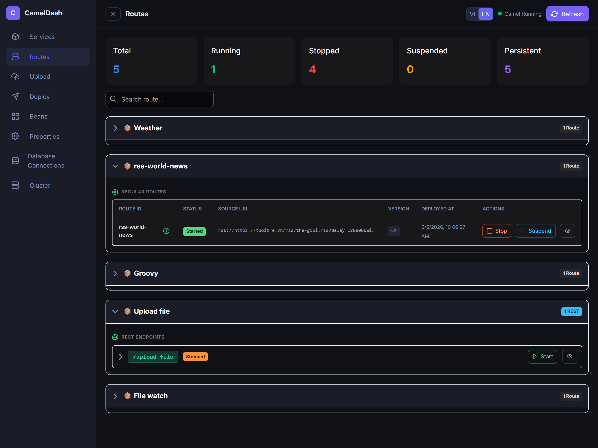

<div align="center">

# 🐪 Camel Dashboard

**Deploy Apache Camel routes without writing Java.**

English | [Tiếng Việt](README_vi.md)

A modern management dashboard for Apache Camel — upload YAML routes, deploy live,
monitor clusters, and let your AI assistant do the heavy lifting via native MCP integration.

[](https://spring.io/projects/spring-boot)
[](https://camel.apache.org/)
[](https://vuejs.org/)
[](https://www.postgresql.org/)
[](https://redis.io/)
[](LICENSE)
[](https://github.com/charlietran1407/apache-camel-dashboard)
[](https://github.com/charlietran1407/camel-dashboard/actions/workflows/docker-image.yml)

· [**📸 Screenshots**](#-screenshots) · [**🚀 Quick Start**](#-quick-start) · [**🤖 MCP Setup**](#-mcp--vibe-coding)

</div>

---

> [!NOTE]
> **Project Status**: This project is currently in the **active development stage**. Features are added regularly, and configurations or APIs may evolve. Contributions and feedback are welcome!

## ✨ What is Camel Dashboard?

Camel Dashboard is a platform for managing Apache Camel routes. Instead of writing Java and recompiling, you:

1. ✍️ **Write YAML** — using the standard Apache Camel YAML DSL (or ask AI to write it)
2. ⬆️ **Upload** — validate and upload to the dashboard
3. 🚀 **Deploy live** — routes load into the running Camel context with zero downtime
4. 📊 **Monitor** — watch routes across all cluster nodes from the dashboard

**MCP-powered**: Connect Claude, Cursor, or any MCP-compatible AI to deploy routes through natural language.

---

## 📸 Screenshots

| Routes View |
|---|
| 

---

## 🚀 Quick Start

### Prerequisites

- Docker & Docker Compose
- Java 21+ (for local dev)
- PostgreSQL 16
- Redis 7 (optional, for cluster mode)

### 1. Clone & Configure

```bash
git clone https://github.com/charlietran1407/apache-camel-dashboard
cd apache-camel-dashboard
cp dockers/.env.example .env
```

Edit `.env` and fill in the required values:

```env
# Required
DATASOURCE_URL=jdbc:postgresql://localhost:5432/cameldash?options=-c%20timezone=UTC
DATASOURCE_USERNAME=cameldash
DATASOURCE_PASSWORD=your-secure-password
CAMEL_DASHBOARD_ENCRYPT_KEY=your-32-char-secret-key

# Optional
CAMEL_CONTEXT_PATH=/cameldash
SERVER_PORT=8080
```

### 2. Start with Docker Compose

Start the infrastructure services (PostgreSQL, Redis, Jaeger) first, followed by the Camel Dashboard application:

```bash
# Start infrastructure
docker-compose -f dockers/docker-compose.infra.yaml up -d

# Start Camel Dashboard
docker-compose -f dockers/example_docker-compose.yaml up -d
```

### 3. Open the Dashboard

- **Camel Dashboard**: Navigate to **http://localhost:8080** — you should see the Camel Dashboard!
- **Jaeger (Distributed Tracing)**: Navigate to **http://localhost:16686** to view route execution and tracing logs.

### 4. Run in Dev Mode (local development)

```powershell
# Backend (Spring Boot with dev profile)
.\mvnw.cmd spring-boot:run -Pdev

# Frontend (Vue dev server with HMR)
cd frontend
pnpm install
pnpm dev
# → http://localhost:5173
```

---

## 🤖 MCP / Vibe Coding

Camel Dashboard ships a **native MCP server** at `/mcp`. Connect any MCP-compatible AI assistant to deploy routes through natural language.

### Add to your AI client

Depending on your IDE or client, use one of the following configurations:

#### Google Antigravity IDE (`mcp_config.json`)
```json
{
  "mcpServers": {
    "camel-dashboard": {
      "serverUrl": "http://localhost:8080/mcp",
      "headers": {
        "X-MCP-API-KEY": "MCP-key"
      }
    }
  }
}
```

#### Claude Desktop / Cursor (`claude_desktop_config.json`)
```json
{
  "mcpServers": {
    "camel-dashboard": {
      "type": "sse",
      "url": "http://localhost:8080/mcp"
    }
  }
}
```

### Available MCP Tools

| Tool | Description |
|---|---|
| `services_upsert` | Create or update a service to group route versions |
| `routes_upload_version` | Upload a YAML route (.yaml or .yml) as a new versioned deployment |
| `routes_validate` | FAST (syntax) or PRE_DEPLOY (runtime dry-run) validation |
| `routes_deploy_version` | Deploy a previously uploaded route version |
| `routes_deploy_and_start` | Deploy and immediately start a route (one-shot) |
| `routes_start` | Start a stopped route by ID |
| `routes_get_status` | Get real-time route status |

### Example AI Workflow

```
You: "Create a REST GET /products endpoint that returns a JSON list of products"

AI (via MCP):
  1. services_upsert → creates "Products API" service
  2. routes_upload_version → uploads generated YAML
  3. routes_deploy_and_start → deploys and starts the route

Result: ✅ Your REST endpoint is live in seconds
```

---

## 📋 Features

### Route Management
- ▶️ Start, ⏹️ stop, ⏸️ suspend, ▶️ resume routes in real-time
- Per-node status across your entire cluster
- Route history with version tracking

### Service & Version Control
- Group related routes into named services
- Infinite version history with descriptions and timestamps
- One-click rollback to any previous version
- Auto-restore on application restart

### Upload & Validation
- Drag-and-drop YAML route files (.yaml or .yml)
- **FAST mode**: syntax + route ID conflict detection
- **PRE_DEPLOY mode**: full runtime dry-run before deployment
- Auto-rollback if route loading fails — service never goes dark

### Cluster Support
- Redis Streams + Pub/Sub for multi-node coordination
- Heartbeat every 10s, node offline detection after 30s
- Auto-eviction after 5 minutes offline
- Per-node route state visibility from any dashboard instance

### Security
- AES-encrypted environment properties
- Inject secrets into routes at runtime
- No secrets in YAML files

### Observability
- Micrometer metrics (route latency, throughput, error rate)
- OpenTelemetry / OTLP integration
- Per-message history tracking

---

## ⚙️ Configuration

All configuration is via environment variables. No secrets should be hardcoded.

### Required Variables

| Variable | Description |
|---|---|
| `DATASOURCE_URL` | PostgreSQL JDBC URL |
| `DATASOURCE_USERNAME` | Database username |
| `DATASOURCE_PASSWORD` | Database password |
| `CAMEL_DASHBOARD_ENCRYPT_KEY` | AES encryption key for sensitive properties |

### Optional Variables

| Variable | Default | Description |
|---|---|---|
| `SERVER_PORT` | `8080` | HTTP server port |
| `CAMEL_CONTEXT_PATH` | `/cameldash` | Camel REST base path |
| `CAMEL_DASHBOARD_CLUSTER_ENABLED` | `false` | Enable Redis cluster coordination |
| `CAMEL_DASHBOARD_CLUSTER_STREAM_KEY` | `{group}:cluster:event:stream` | Redis stream key |
| `CAMEL_DASHBOARD_CLUSTER_CHANNEL` | `{group}:cluster:event:channel` | Redis pub/sub channel |
| `REDIS_HOST` | — | Redis host (required if cluster enabled) |
| `REDIS_PORT` | — | Redis port |
| `REDIS_PASSWORD` | — | Redis password |
| `OTEL_LOGS_EXPORTER` | `none` | `otlp` or `none` |
| `OTEL_EXPORTER_OTLP_ENDPOINT` | — | OTLP collector endpoint |

### Cluster Groups

If you run multiple logical clusters on the same Redis, use the group name as a namespace:

```env
CAMEL_DASHBOARD_CLUSTER_GROUP=payment
CAMEL_DASHBOARD_CLUSTER_STREAM_KEY=payment:cluster:event:stream
CAMEL_DASHBOARD_CLUSTER_CHANNEL=payment:cluster:event:channel
```

---

## 🏗️ Architecture

```
┌──────────────────────────────────────────────────────┐
│                   Camel Dashboard                    │
├────────────────────┬─────────────────────────────────┤ 
│   Vue 3 Frontend   │      Spring Boot Backend        │
│   (PrimeVue +      │   ┌──────────┐ ┌────────────┐   │
│    TailwindCSS)    │   │  Camel   │ │ MCP Server │   │
│                    │   │ Context  │ │ (/mcp)     │   │
│  ┌──────────────┐  │   └──────────┘ └────────────┘   │
│  │ Routes View  │  │   ┌──────────────────────────┐  │
│  │ Services     │  │   │   Route Version Service  │  │
│  │ Upload       │◄─┤──►│   (YAML storage + index) │  │
│  │ Versions     │  │   └──────────────────────────┘  │
│  │ Deploy       │  │   ┌──────────────────────────┐  │
│  │ Cluster      │  │   │  Cluster Node Service    │  │
│  │ Beans        │  │   │  (Standalone / Redis)    │  │
│  │ Properties   │  │   └──────────────────────────┘  │
│  └──────────────┘  │                                 │
└────────────────────┴─────────────────────────────────┘
         │                        │
    REST API /api/*         ┌─────┴──────┐
                            │ PostgreSQL │
                            │ + Flyway   │
                            └─────┬──────┘
                                  │ (optional)
                            ┌─────┴──────┐
                            │   Redis    │
                            │ (cluster)  │
                            └────────────┘
```

---

## 🛠️ Tech Stack

| Layer | Technology |
|---|---|
| Backend | Spring Boot 3, Apache Camel 4 |
| Frontend | Vue 3, PrimeVue, TailwindCSS, Vite |
| Database | PostgreSQL 16 + Flyway migrations |
| Cluster | Redis 7 (Streams + Pub/Sub) |
| AI / MCP | Spring AI MCP Server (Streamable HTTP) |
| Observability | Micrometer, OpenTelemetry |
| Build | Maven (thin JAR + libs/) |
| Container | Docker + Docker Compose |

## 🚢 Production Deployment

### Build

```powershell
# Build frontend and embed in JAR
cd frontend && pnpm build

# Package thin JAR (no dev dependencies)
.\mvnw.cmd clean package -DskipTests
```
### Run

```powershell
java -Dloader.path=libs -jar target/camel-dashboard-xxx.jar
```

> **Note**: The `libs/` directory (by default `./libs` in the working directory) must be specified via `-Dloader.path` for dynamic driver and component loading to work.

### Docker

**Option 1: Pull pre-built image from GitHub Container Registry**

```bash
# Latest stable (main branch)
docker pull ghcr.io/charlietran1407/camel-dashboard:latest

# Specific version
docker pull ghcr.io/charlietran1407/camel-dashboard:1.2.9
```

```bash
docker run -p 8080:8080 --env-file .env ghcr.io/charlietran1407/camel-dashboard:latest
```

**Option 2: Build locally**

```bash
docker build -t camel-dashboard .
docker run -p 8080:8080 --env-file .env camel-dashboard
```
---

## 🤝 Contributing

Contributions are welcome! Please:

1. Fork the repository
2. Create a feature branch: `git checkout -b feature/amazing-feature`
3. Commit your changes: `git commit -m 'feat: add amazing feature'`
4. Push to the branch: `git push origin feature/amazing-feature`
5. Open a Pull Request

---

## 📝 License
- The source code of this project is licensed under the Apache License, Version 2.0 — see the [LICENSE](LICENSE) file for details.
- PrimeVue, licensed under the MIT 
- Apache Camel is developed by the Apache Software Foundation and licensed under the [Apache License, Version 2.0](https://www.apache.org/licenses/LICENSE-2.0).

## Disclaimer
This product is independent and is not affiliated with, endorsed by, or sponsored by the Apache Software Foundation. "Apache", "Camel", and "Apache Camel" are trademarks of the Apache Software Foundation.