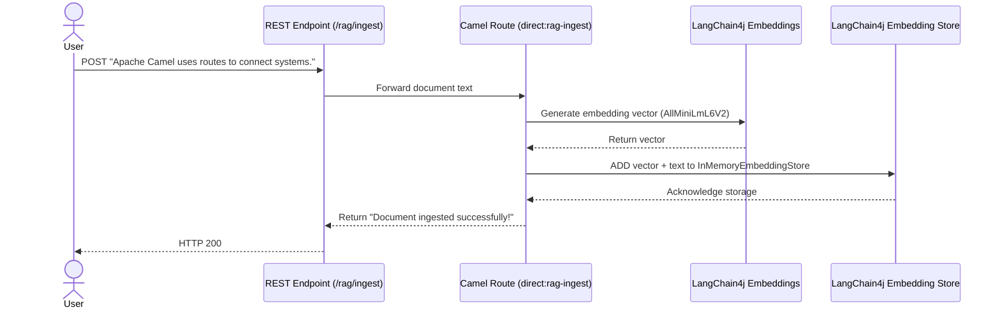
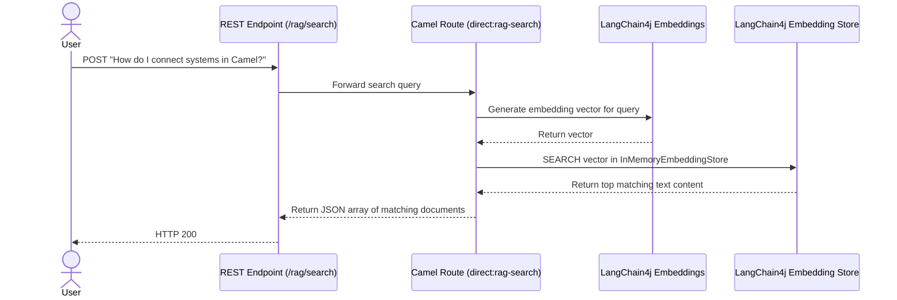

# 🗄️ LangChain4j RAG (Vector Ingestion & Search) with Camel

This example demonstrates how to implement a local, self-contained **Retrieval-Augmented Generation (RAG)** ingestion and lookup pipeline using **Apache Camel** and **LangChain4j**. It sets up an in-memory vector store, generates embeddings using a local ONNX model, and allows you to ingest text documents and search for matching segments.

---

## 🏗️ Architecture & Flow

### 1. Ingestion Flow (`/rag/ingest`)


### 2. Search Flow (`/rag/search`)


---

## ⚙️ Prerequisites & Setup

### 1. Get a Gemini API Key
To use the Google Gemini embedding model, you need an API key from [Google AI Studio](https://aistudio.google.com/).

### 2. Configure Environment Properties in Camel Dashboard
Define the following environment variable or property:

| Property Name | Example Value | Description |
|---|---|---|
| `GEMINI_API_KEY` | `AIzaSyD...` | Your Gemini API Key |

---

## 📦 Dependency & Classpath Setup

Because this example dynamically registers an `InMemoryEmbeddingStore` and `GoogleAiEmbeddingModel` bean, the class files must be available on the Camel Dashboard JVM classpath.

Choose **one** of the options below depending on how you are running the application:

### Option A: Local Development Mode (Running via `mvnw spring-boot:run`)
If you are running the backend in development mode, the simplest way to add the dependencies is to declare them in the main [`pom.xml`](../../pom.xml):

1. Open [`pom.xml`](../../pom.xml) at the project root.
2. Add the following dependencies under `<dependencies>`:
   ```xml
   <dependency>
       <groupId>dev.langchain4j</groupId>
       <artifactId>langchain4j-google-ai-gemini</artifactId>
       <version>1.16.1</version>
   </dependency>
   <dependency>
       <groupId>org.apache.camel.springboot</groupId>
       <artifactId>camel-langchain4j-embeddings-starter</artifactId>
   </dependency>
   <dependency>
       <groupId>org.apache.camel.springboot</groupId>
       <artifactId>camel-langchain4j-embeddingstore-starter</artifactId>
   </dependency>
   ```
3. Restart your backend application.

---

### Option B: Production / Standalone Mode (Jar/Docker)
If you are running the packaged Camel Dashboard JAR, dependencies are loaded dynamically from the configured loader path (default is `./libs`):

1. From the `examples/langchain4j-rag` directory, run the following command to automatically download the required artifacts and all of their transitive dependencies directly into the `./libs` directory at the project root:
   ```bash
   mvn package
   ```

2. Restart the Camel Dashboard backend.

> [!NOTE]
> Camel Dashboard dynamically scans the deployed route. It will automatically attempt to resolve the Camel component schemes `langchain4j-embeddings` and `langchain4j-embeddingstore` if missing. However, third-party libraries like `langchain4j-google-ai-gemini` must be staged manually.

---

## 🚀 Deploy the Route

1. Open the Camel Dashboard UI (`http://localhost:8080`).
2. Navigate to **Services** and create a new service called `Langchain4j RAG`.
3. Go to **Upload**, upload the [`langchain4j-rag.camel.yaml`](./langchain4j-rag.camel.yaml) file, and assign it to the `Langchain4j RAG` service.
4. Click **Deploy & Start** to run the route.

---

## 🧪 Testing the Endpoint

### 1. Ingest Documents
Submit several document segments to build your vector database knowledge base:

```bash
# Ingest document 1
curl -X POST http://localhost:8080/cameldash/rag/ingest \
  -H "Content-Type: text/plain" \
  -d "Apache Camel is an open source integration framework based on Enterprise Integration Patterns (EIP)."

# Ingest document 2
curl -X POST http://localhost:8080/cameldash/rag/ingest \
  -H "Content-Type: text/plain" \
  -d "Kubernetes is a container orchestration tool that automates deployment and scaling of applications."
```

### 2. Search the Vector Database
Query the database with a question to retrieve matching context:

```bash
curl -X POST http://localhost:8080/cameldash/rag/search \
  -H "Content-Type: text/plain" \
  -d "What is Apache Camel?"
```

#### Expected Output:
```json
[
  "Apache Camel is an open source integration framework based on Enterprise Integration Patterns (EIP)."
]
```
Notice that it successfully retrieved the document relevant to "Apache Camel" and did not return the irrelevant document about Kubernetes!
