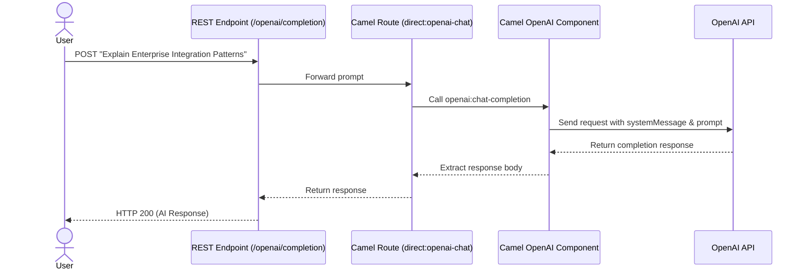

# 🤖 Direct OpenAI Chat Completion with Camel

This example demonstrates how to use Apache Camel's native **OpenAI Component** within the **Camel Dashboard** to interact directly with the OpenAI API for chat completions.

---

## 🏗️ Architecture & Flow



---

## ⚙️ Prerequisites & Setup

### 1. Get an OpenAI API Key
You will need an active API key from the [OpenAI Platform](https://platform.openai.com/).

### 2. Configure Environment Properties in Camel Dashboard
Configure the following properties in the Camel Dashboard settings or as environment variables:

| Property Name | Example Value | Description |
|---|---|---|
| `OPENAI_API_KEY` | `sk-proj-...` | Your OpenAI API Key |
| `OPENAI_MODEL` | `gpt-4o-mini` | The model ID to use (defaults to `gpt-4o-mini` if not specified) |

---

## 📦 Dependency & Classpath Setup

Choose **one** of the options below depending on how you are running the application:

### Option A: Local Development Mode (Running via `mvnw spring-boot:run`)
If you are running the backend in development mode, the simplest way to add the dependency is to declare it in the main [`pom.xml`](../../pom.xml):

1. Open [`pom.xml`](../../pom.xml) at the project root.
2. Add the following dependency under `<dependencies>`:
   ```xml
   <dependency>
       <groupId>org.apache.camel.springboot</groupId>
       <artifactId>camel-openai-starter</artifactId>
   </dependency>
   ```
3. Restart your backend application.

---

### Option B: Production / Standalone Mode (Jar/Docker)
If you are running the packaged Camel Dashboard JAR, dependencies are loaded dynamically from the configured loader path (default is `./libs`):

1. Download the following Maven artifact (and its dependencies) and copy it into the `./libs` directory at the project root:
   - `org.apache.camel:camel-openai:4.20.0`

2. Alternatively, you can use the Maven dependency plugin to download and place it into the `./libs` directory:
   ```bash
   mvn dependency:copy -Dartifact=org.apache.camel:camel-openai:4.20.0:jar -DoutputDirectory=./libs
   ```

3. Restart the Camel Dashboard backend.

> [!NOTE]
> Camel Dashboard dynamically scans the deployed route. It will automatically attempt to resolve the Camel component scheme `openai` if missing.

---

## 🚀 Deploy the Route

1. Open the Camel Dashboard UI (`http://localhost:8080`).
2. Navigate to **Services** and create a new service called `OpenAI Direct`.
3. Go to **Upload**, upload the [`openai-direct.camel.yaml`](./openai-direct.camel.yaml) file, and assign it to the `OpenAI Direct` service.
4. Click **Deploy & Start** to run the route.

---

## 🧪 Testing the Endpoint

Submit a POST request with your query:

```bash
curl -X POST http://localhost:8080/cameldash/openai/completion \
  -H "Content-Type: text/plain" \
  -d "What is the Splitter pattern in Apache Camel?"
```

### Expected Output:
```text
The Splitter pattern in Apache Camel is an Enterprise Integration Pattern (EIP) used to split a single incoming message into multiple individual messages, which can then be processed independently...
```
